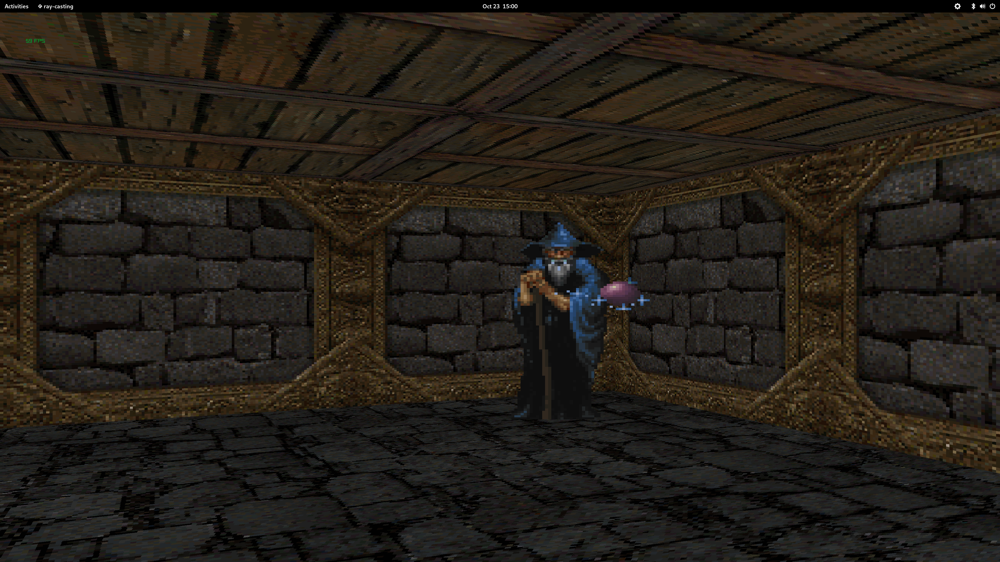
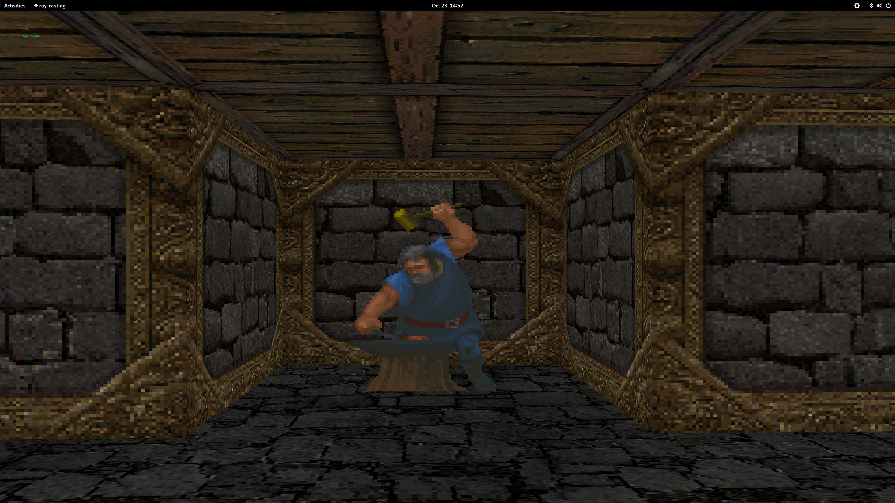
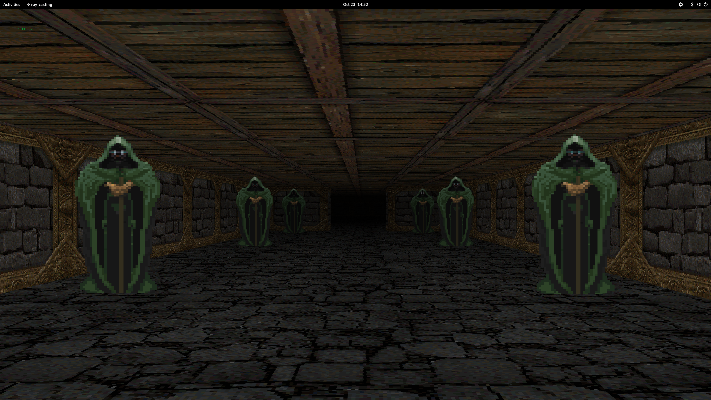

# Raycasting

<p align="center">
  
</p>


A compact raycasting engine powered by [raylib](https://www.raylib.com/), designed to simulate 3D environments using 2D maps. Inspired by classic games like Wolfenstein 3D, this project demonstrates core concepts of 2.5D rendering, player movement, wall detection, and textured environments.


## Features

- 2D grid-based map system
- Raycasting for wall detection and rendering
- Drawing of different animated sprites
- Basic player movement and rotation
- Texture support for walls and NPCs
- Built using the C-based raylib framework
- Fixed-point arithmetic and optimization through bitwise operations
- Multi-threading done with the help of OpenMP


## Prerequisites

- Linux
- GCC compiler (Clang doesn't automatically include the OpenMP library)


## Installation

```bash
git clone https://github.com/barlukh/raycasting.git
cd raycasting
make
./raycasting
```


## Functionality

- Controls: W, A, S, D to move, mouse for camera rotation, ESC to exit
- Map tiles can be modified in the level/map.rcm file (all lines must end with newline)
- Folder graphics/ has a variety of textures, you can set paths to them in the .h file
- There isn't any game mechanic, this project is mostly a showcase of a graphical engine
- Various varibles can be set to different values in the .h file (darkness, speed, etc...)
- Multi-threading applied through OpenMP where applicable


## License

**This project** is licensed under the [GNU GPLv3](https://www.gnu.org/licenses/gpl-3.0.en.html).

**Raylib** is licensed under the [zlib/libpng license](https://www.raylib.com/license.html), which is compatible with GPL.

When distributing this project, please ensure:
- You include the full text of the GPLv3 license.
- You retain raylib’s original license notice.
- You clearly mark any modifications made to the original code.


## Credits

- [raylib](https://www.raylib.com/) raylib © 2013–present Ramon Santamaria
- [Shadoofus](https://www.trsearch.org/member/3926) Tile textures
- [madhattervx](https://www.spriters-resource.com/profile/madhattervx/) NPC sprite textures


## Known Issues

#### Data race condition
- Valgrind with --tool=helgrind flag is picking up on data race condition with the Image *data buffer. I am not sure if it is a false flag, but it is good to be aware of it. I didn't use raylib's own function to get and set pixel colors since they were too slow. Multiple threads accessing the same pixel buffer of an image and setting colors based on an offset is probably what Valgrind doesn't like. Let me know if you find out what's causing it.


## Screenshots

<p align="center">
  
</p>

<p align="center">
  
</p>

<p align="center">
  
</p>
